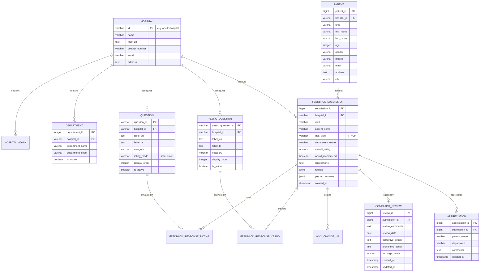

# Hospital Management System (HMS) - Master AI Prompt & Project Documentation Kit

This document provides the **Master Prompt** designed for **Claude**, **ChatGPT**, or any LLM to generate a complete, publication-ready **Final Project Report, Case Study, or Academic/Corporate Handover Presentation** for the Hospital Management System (HMS) Feedback & Clinical Analytics Platform.

---

## 📋 How to Use This Prompt

1. Copy the entire prompt block below (between `--- START OF PROMPT ---` and `--- END OF PROMPT ---`).
2. Paste it into **Claude 3.5 Sonnet**, **ChatGPT (GPT-4o)**, or your AI tool of choice.
3. Attach or refer to the generated diagrams, database dumps, and QA tables.

---

### --- START OF PROMPT ---

```markdown
You are a Principal Software Architect and Lead Technical Writer. I need you to generate an exhaustive, publication-grade Final Technical Project Report and Case Study for our enterprise web application: "Hospital Management System (HMS) - Patient Feedback, Quality Audit & Clinical Analytics Platform (V6.6)".

Here is the complete project context, original specifications, historical QA defects and corrections, database architecture, and ER diagram.

==============================================================================
1. PROJECT OVERVIEW & VALUE PROPOSITION
==============================================================================
- Project Name: Hospital Management System (HMS) Patient Feedback & Clinical Analytics Platform
- Version: V6.6
- Developed With: Google Antigravity IDE (Google DeepMind Agentic Coding Environment)
- Core Purpose: Modern multi-tenant hospital platform to digitize paper-based patient feedback, provide real-time bilingual (English & Tamil) survey collection, streamline administrative quality audits, investigate complaints with Corrective/Preventive Actions (CAPA), generate multi-section Excel/CSV reports, and print 100% full-width A4 executive summaries.
- Live URL: https://hms-2-4.vercel.app
- Tech Stack:
  * Frontend: React 18, TypeScript, Vite, Tailwind CSS v4, Lucide Icons, Sonner Toasts, @dnd-kit (drag & drop)
  * Cloud Backend: Node.js Vercel Serverless Functions (/api/*.js)
  * Cloud Database: PostgreSQL (Supabase / Neon with SSL pooling)
  * Local Backend: PHP 8.x, Apache XAMPP on-premise intranet support
  * Asset Sync: sync-dist.js automated multi-target distribution synchronizer

==============================================================================
2. ORIGINAL 5-PAGE PHYSICAL HOSPITAL FORM DIGITIZED
==============================================================================
The platform is an exact digital transformation of the hospital's standardized 5-page physical questionnaire:
- Page 1 (Patient Record / நோயாளி தகவல்):
  * Identifiers: UHID (பதிவு எண்), Name (பெயர்), Age (வயது), Gender (பாலினம்: Male/Female/Other), Mobile (கைபேசி எண்), Email (மின்னஞ்சல்), Address (முகவரி), City (நகரம்).
  * Admission Details: OP No & Date (புறநோயாளி எண் & தேதி), IP No & Date (உள்நோயாளி எண் & தேதி), Date of Admission (அனுமதித்த தேதி), Date of Discharge (சென்ற தேதி).
- Page 2 (Why Choose Us / நீங்கள் மருத்துவமனையை தேர்ந்தெடுத்தற்கான காரணம்?):
  * Options: Self Opinion (உள்ளுணர்வு), Ads/News (விளம்பரம்), Friends/Relatives (நண்பர்கள்/உறவினர்கள்), Corporate (நிறுவனம்), Employee (பணியாட்கள்), Referral Doctor (பரிந்துரைக்கப்பட்ட மருத்துவர்), Others.
- Pages 2 & 3 (13 Department Ratings / சேவை கருத்துக்கள் - 4-Scale: Excellent/Good/Average/Poor):
  1. Responsiveness at Reception (வரவேற்பறையில் கவனிப்பு)
  2. Admission Process (உள்சேர்க்கை முறை)
  3. Billing Services (பில்லிங் சேவைகள்)
  4. Doctor's Treatment (மருத்துவரின் கவனிப்பு)
  5. Nursing Care (செவிலியர் சேவை)
  6. Pharmacy Services (மருந்தக சேவைகள்)
  7. X-ray and Scan (எக்ஸ்-ரே மற்றும் ஸ்கேன்)
  8. Laboratory Services (ஆய்வக சேவைகள்)
  9. Insurance Services (காப்பீட்டு சேவைகள்)
  10. Food Services (உணவு சேவைகள்)
  11. Physiotherapy (பிசியோதெரபி)
  12. Blood Bank Services (இரத்த வங்கி சேவைகள்)
  13. Overall Service (ஒட்டுமொத்த சேவைகளின் மதிப்பு)
- Page 3 (Hygiene & Financial Inquiries / கேள்விகள்):
  14. Hospital Environment Cleanliness (சுற்றுப்புற தூய்மை - கழிப்பறைகள் / மற்ற இடங்கள்) [Yes/No, specify where]
  15. Estimated Cost Informed at Admission Counter? (சிகிச்சை கட்டணம் கூறப்பட்டதா?) [Yes/No]
  16. Would you refer Hospital to Family/Friends? (பரிந்துரைப்பீர்களா?) [Yes/No]
- Page 4 (Improvement & Staff Appreciation / மேம்பாடுகள் & பாராட்டுக்கள்):
  17. Suggestions for further improvement (முன்னேற்றுவதற்கு கருத்துக்கள்)
  18. Staff Appreciation (தனிப்பட்ட நபர் / சேவை பாராட்டு: Name & Department)
  * Patient Signature Confirmation (நோயாளியின் கையொப்பம்)
- Page 5 (For Office Use Only / அலுவலக பயன்பாட்டிற்கு மட்டும்):
  * Review of the Complaint (புகார் மீதான ஆய்வு)
  * Date of Review (ஆய்வு செய்யப்பட்ட தேதி)
  * Corrective Action Taken (சரிசெய்யும் நடவடிக்கை)
  * Preventive Action (தடுப்பு நடவடிக்கை)
  * Incharge Name / Signature (பொறுப்பாளர் பெயர்)

==============================================================================
3. QA DEFECTS RESOLVED & TECHNICAL CORRECTIONS (27/27 TICKETS FIXED)
==============================================================================
1. Save Office Details Button Not Working (#19, Ref 16):
   - Created /api/save-office-use endpoint connecting to PostgreSQL complaint_review table; wired OfficeUseModal state.
2. Edit Office Review Button Inactive (#20, Ref 17):
   - Built handleEditOfficeReview trigger pre-populating existing investigation notes, dates, and actions.
3. Data Not Saving to Resolved Tab (#21, Ref 18):
   - Synchronized local React dictionary state with database join in /api/get-responses, updating resolved counters immediately.
4. Missing Download Report Button (#22, Ref 18):
   - Added Download Report button; built export.service.ts producing UTF-8 BOM 3-section structured Excel/CSV reports.
5. Tamil Submissions Omitted in Admin (#23, Ref 19):
   - Enforced UTF-8 charset encoding across PostgreSQL pool, serverless APIs, and React table renderers.
6. Direct URL Copy-Paste (#24, Ref 24):
   - Built getEffectiveHospitalId resolving ?hospital_id= parameter and localStorage with zero blank screen glitches.
7. Action Buttons in Feedback Report:
   - Wired "Resolve Problem" on unresolved cards and "Edit Office Review" on resolved cards.
8. Corrupted Tamil Font / Mojibake (#14, Ref 11):
   - Standardized Unicode strings in database and constants (வரவேற்பு பதில், சேர்க்கை செயல்முறை, பில்லிங் சேவைகள்).
9. Tamil Patient Name Validation Failure (#15, Ref 12):
   - Updated regex in App.tsx to /^[\p{L}\s.]+$/u and [஀-௿] Unicode range.
10. Questionnaire Broken Characters (#16, Ref 13):
    - Cleaned and verified all database survey question definitions.
11. Form Builder Save Button (#17, Ref 14):
    - Connected /api/save-questions with @dnd-kit drag-and-drop sortable context.
12. Blank Form Warning (#18, Ref 15):
    - Localized validation toasts in Tamil & English via Sonner.
13. Form Inputs Validation (#1-#13):
    - 6-digit OTP regex, Age bounds (1-120), RFC email validation, Back to Form direct routing.
14. Print Report Blank Page & Left Sidebar Issue:
    - Set aside/header to display:none !important; width:0; position:absolute; left:-99999px;
    - Expanded main report to width:100% with 2-column card grid fitting standard A4 paper.

==============================================================================
4. DATABASE SCHEMA & ENTITY-RELATIONSHIP (ER) DIAGRAM
==============================================================================
The database contains 18 relational tables in PostgreSQL:



==============================================================================
OUTPUT REQUIREMENTS FOR THIS REPORT:
==============================================================================
Please generate a formal, structured document with the following chapters:
1. Executive Summary & Problem Statement
2. Physical Form Analysis & Digital Transformation Architecture
3. System Architecture & Dual-Deployment Model (Vercel Serverless + Local XAMPP)
4. Database Architecture & ER Diagram Analysis
5. Complete QA Defect Resolution Matrix (Documenting all 27 tickets, causes, and architectural remedies)
6. Administrative & Clinical Decision Support Workflows (CAPA, Multi-Section Export, A4 Print Engine)
7. Security, Localization (Tamil/English UTF-8), and Quality Compliance
8. Step-by-Step Deployment & Handover Guide for New Developers (Supabase + Vercel)
9. Conclusion & Engineering Credits (Google Antigravity IDE)

Make the tone highly professional, precise, and formatted with clean Markdown headers, tables, callout alerts, and code blocks.
```

### --- END OF PROMPT ---

---

## 📊 Complete Entity-Relationship (ER) Architecture


