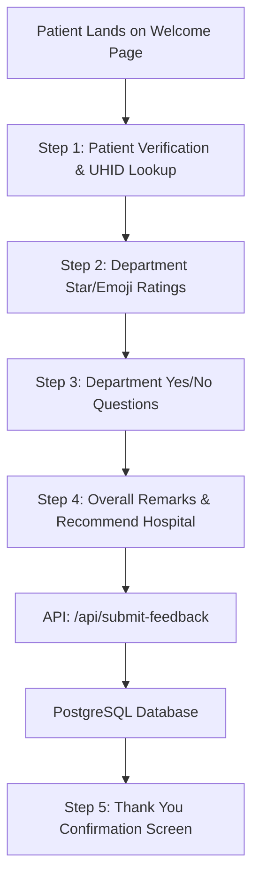
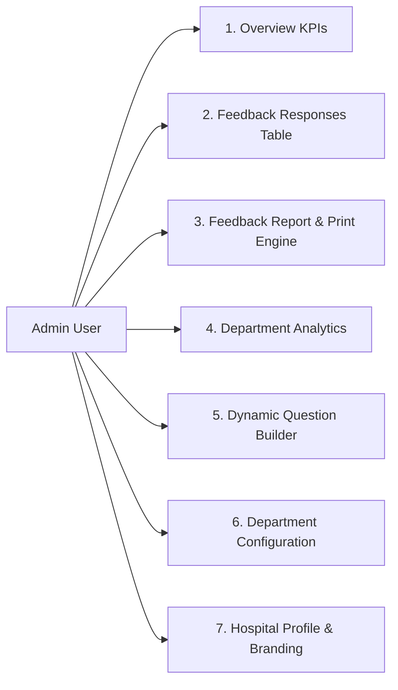

# Hospital Management System (HMS) - Patient Feedback & Analytics Platform
# Transfer of Information (TOI) & Technical Handover Document

---

## 1. Executive Summary & Purpose

The **Hospital Management System (HMS) Patient Feedback & Analytics Platform** is an enterprise-grade web application engineered to capture, aggregate, analyze, and act upon multi-departmental inpatient (IP) and outpatient (OP) patient experiences in real time.

### Key Objectives
- **Patient Engagement**: Deliver an intuitive, bilingual (English & Tamil), mobile-responsive feedback collection flow.
- **Administrative Action & Compliance**: Provide hospital administrators and quality officers with a real-time analytics dashboard, dynamic question management, complaint investigation logging (corrective & preventive actions), Excel/CSV multi-section export, and print-ready A4 executive reports.
- **Dual-Platform Architecture**: Function as a standalone cloud application on **Vercel** with PostgreSQL database and Node.js Serverless Functions, while remaining fully compatible with local hospital intranet **XAMPP / PHP / MySQL / PostgreSQL** infrastructure.

---

## 2. Technology Stack

| Layer | Technology | Purpose |
|---|---|---|
| **Frontend Framework** | React 18 + TypeScript + Vite | Component-driven, type-safe UI architecture |
| **Styling & Design** | Tailwind CSS v4 + Lucide Icons | Responsive modern interface, theme tokens, print CSS |
| **State & Drag-and-Drop**| `@dnd-kit/core`, `@dnd-kit/sortable` | Dynamic drag-and-drop question ordering |
| **Notifications** | `sonner` (Toast) | Non-blocking user feedback alerts |
| **Cloud Backend** | Vercel Serverless Node.js Functions (`api/*.js`) | RESTful serverless microservices |
| **Cloud Database** | PostgreSQL (Neon / @vercel/postgres) | Relational storage for feedback, complaints, questions |
| **Local Backend** | PHP 8.x (`backend/admin/*.php`) | On-premise XAMPP integration proxy |
| **Build & Asset Sync** | Node.js `sync-dist.js` | Synchronizes compiled Vite bundles across distributions |

---

## 3. Directory Structure & Architecture

```plaintext
HMS_V6.6/
├── api/                           # Vercel Serverless API Functions
│   ├── db.js                      # Centralized PostgreSQL Connection Pool
│   ├── get-hospitals.js           # Hospital Profile & Branding
│   ├── get-patient.js             # Patient UHID Verification
│   ├── get-questions.js           # Dynamic Question Registry
│   ├── get-responses.js           # Feedback Submissions & Complaint Reviews
│   ├── login-ajax.js              # Admin Authentication
│   ├── save-office-use.js         # Office Investigation & Resolution Action API
│   ├── save-questions.js          # Dynamic Question CRUD API
│   └── submit-feedback.js         # Feedback Submission Ingestion API
├── archive/                       # Archived Test & Scratch Scripts
│   └── test_scripts/              # Historical test and diagnostic PHP/JS files
├── backend/                       # Local PHP/XAMPP Integration
│   ├── admin/                     # Dashboard & Login PHP Proxies
│   └── config/                    # Local Database Config
├── frontend/                      # Production Built Assets (Synced from Vite)
├── frontend_source/               # React + TypeScript Source Code
│   ├── src/
│   │   ├── app/
│   │   │   ├── components/
│   │   │   │   ├── admin/         # Modular Admin Subcomponents
│   │   │   │   │   ├── AdminSidebar.tsx
│   │   │   │   │   ├── AdminHeader.tsx
│   │   │   │   │   └── OfficeUseModal.tsx
│   │   │   │   ├── common/        # Shared UI Controls (Stars, Emojis, Toggles)
│   │   │   │   │   ├── StarRating.tsx
│   │   │   │   │   ├── EmojiRating.tsx
│   │   │   │   │   ├── ToggleSwitch.tsx
│   │   │   │   │   ├── ThreeStateToggle.tsx
│   │   │   │   │   └── SelectableCard.tsx
│   │   │   │   ├── AdminDashboard.tsx   # Admin Coordinator Component
│   │   │   │   ├── HospitalSelection.tsx# Hospital Picker
│   │   │   │   └── WelcomePage.tsx      # Welcome Screen
│   │   │   ├── App.tsx            # Patient Feedback Wizard Coordinator
│   │   │   └── real_db_data.ts    # Seed & Fallback Data Definitions
│   │   ├── services/              # API Client & Export Logic
│   │   │   ├── api.service.ts     # Centralized HTTP Client
│   │   │   ├── export.service.ts  # 3-Section Structured CSV/Excel Engine
│   │   │   └── index.ts           # Barrel Export
│   │   ├── types/                 # Shared TypeScript Type Definitions
│   │   │   ├── admin.types.ts
│   │   │   ├── feedback.types.ts
│   │   │   ├── office-use.types.ts
│   │   │   └── index.ts
│   │   └── styles/                # CSS & Print Style Rules
├── public/                        # Static Assets & Public Index
├── sync-dist.js                   # Build-time multi-target asset sync script
├── vercel.json                    # Vercel Routing & Deployment Configuration
└── TOI_DOCUMENT.md                # This Knowledge Transfer Document
```

---

## 4. Patient Feedback Wizard Flow



### Wizard Lifecycle
1. **Language Selection**: Patients can toggle between **English** and **தமிழ் (Tamil)** at any time. All question labels, hints, and error alerts dynamically update.
2. **UHID Auto-Lookup**: When a patient enters their UHID, `/api/get-patient` pre-populates patient details (Name, Visit Type, Mobile, Department).
3. **Department Ratings**: Multi-department rating cards rendered with star scales (1 to 5) or animated emojis.
4. **Yes/No Checkpoints**: Binary/trinary service inquiries (Cleanliness, Cost transparency, Referral willingness).
5. **Inactivity Timer**: Automatic timeout after 60 seconds of inactivity on the Thank You screen, returning to the welcome screen for the next patient.

---

## 5. Administrative Dashboard & Operational Workflows

The Admin Dashboard provides 7 core modules:



### Key Workflows:
1. **Office Use & Problem Resolution Workflow**:
   - For unresolved patient feedback or low ratings, admins click **"Resolve Problem"** or **"Edit Office Review"**.
   - Opens `OfficeUseModal` to log:
     - **Review of Complaint**: Detailed explanation of patient issue.
     - **Date of Review**: Official review timestamp.
     - **Corrective Action Taken**: Immediate corrective measures.
     - **Preventive Action**: Long-term policy adjustments.
     - **Incharge Name**: Officer responsible for resolution.
   - Saves to `complaint_review` table via `/api/save-office-use`.

2. **Clean 3-Section Excel / CSV Export**:
   - Generates structured CSV with UTF-8 BOM (`\uFEFF`) containing:
     - **Section 1**: Department Rating Questions Summary (5★ distribution, counts & percentages).
     - **Section 2**: Department Yes/No Questions Breakdown.
     - **Section 3**: Individual Patient Responses & Office Resolution Log.

3. **100% Full-Width A4 Print Engine**:
   - Zero sidebar / header interference in print preview.
   - Automatically renders cards into a clean **2-column grid** across the full page width.
   - Avoids awkward page breaks inside cards using `break-inside: avoid`.

---

## 6. Database Schema Reference (PostgreSQL)

### 1. `hospitals`
Stores registered hospital profiles and branding.
- `id` (VARCHAR PRIMARY KEY) - e.g. `apollo-hospital`
- `name` (VARCHAR)
- `logo_url` (TEXT)
- `contact_number` (VARCHAR)
- `email` (VARCHAR)
- `address` (TEXT)

### 2. `feedback_submission` / `patient_feedback`
Stores individual patient feedback entries.
- `id` (SERIAL PRIMARY KEY)
- `hospital_id` (VARCHAR)
- `uhid` (VARCHAR)
- `patient_name` (VARCHAR)
- `visit_type` (VARCHAR) - `IP` or `OP`
- `department_name` (VARCHAR)
- `overall_rating` (NUMERIC)
- `would_recommend` (BOOLEAN)
- `suggestions` (TEXT)
- `ratings` (JSONB) - Key-value map of `{ [question_id]: score }`
- `yes_no_answers` (JSONB) - Key-value map of `{ [question_id]: boolean }`
- `created_at` (TIMESTAMP)

### 3. `complaint_review`
Stores administrative investigations and corrective actions.
- `id` (SERIAL PRIMARY KEY)
- `hospital_id` (VARCHAR)
- `uhid` (VARCHAR)
- `review_of_complaint` (TEXT)
- `date_of_review` (DATE)
- `corrective_action` (TEXT)
- `preventive_action` (TEXT)
- `incharge_name` (VARCHAR)
- `created_at` / `updated_at` (TIMESTAMP)

### 4. `questions`
Dynamic question registry for ratings and binary checks.
- `id` (VARCHAR PRIMARY KEY)
- `hospital_id` (VARCHAR)
- `label_en` (TEXT)
- `label_ta` (TEXT)
- `question_type` (VARCHAR) - `rating` or `yes_no`
- `rating_mode` (VARCHAR) - `star` or `emoji`
- `category` (VARCHAR)
- `order_index` (INTEGER)
- `is_deleted` (BOOLEAN)

---

## 7. API Endpoints Reference

| Endpoint | Method | Description |
|---|---|---|
| `/api/get-hospitals` | `GET` | Fetches hospital profile, branding, and config |
| `/api/get-patient` | `GET` | Validates UHID and returns patient registration data |
| `/api/get-questions` | `GET` | Returns list of active and past dynamic feedback questions |
| `/api/get-responses` | `GET` | Returns feedback submissions merged with complaint review actions |
| `/api/submit-feedback`| `POST` | Ingests new patient feedback submissions |
| `/api/save-office-use`| `POST` | Upserts complaint reviews, corrective, and preventive actions |
| `/api/save-questions` | `POST` | Saves custom questions, bilingual labels, and ordering |
| `/api/login-ajax` | `POST` | Validates admin credentials and issues session token |

---

## 8. Complete Step-by-Step Setup Guide (Beginner Friendly)

### A. Prerequisites Installation
1. Install **Node.js LTS (v18+)** from [nodejs.org](https://nodejs.org/).
2. Install **Git** from [git-scm.com](https://git-scm.com/).
3. Install **VS Code** (recommended editor).

### B. Supabase Cloud Database Setup
1. Create a free account at [supabase.com](https://supabase.com/).
2. Create a new project (e.g. `hms-feedback-db`), set a database password, and choose your preferred region.
3. In Supabase, navigate to **SQL Editor** $\rightarrow$ **New query**.
4. Open [`database_dump_with_data.sql`](./database_dump_with_data.sql), copy the entire SQL script, paste into SQL Editor, and click **Run**.
5. Retrieve your database connection settings from **Project Settings** $\rightarrow$ **Database**:
   - Host, Port (`5432`), Database (`postgres`), User (`postgres.[REF]`), Password.

### C. Local Project Setup & Development
1. Clone the repository:
   ```bash
   git clone https://github.com/Avaneesh-ravi/HMS_2.4.git
   cd HMS_2.4
   ```
2. Navigate into `frontend_source/` and install dependencies:
   ```bash
   cd frontend_source
   npm install
   ```
3. Start the local development server:
   ```bash
   npm run dev
   ```
   Open `http://localhost:5173/` in your browser.
4. Build production bundles:
   ```bash
   npm run build
   ```
   *(Compiles React components and automatically syncs to `frontend/`, `api/frontend/`, and `public/` via `sync-dist.js`).*

### D. Vercel Cloud Deployment Setup
1. Sign in to [vercel.com](https://vercel.com/) with GitHub.
2. Click **Add New...** $\rightarrow$ **Project** and select `HMS_2.4`.
3. Configure Environment Variables in Vercel:
   - `DB_HOST`: Your Supabase Host
   - `DB_PORT`: `5432`
   - `DB_NAME`: `postgres`
   - `DB_USER`: Your Supabase User
   - `DB_PASS`: Your Supabase Password
4. Click **Deploy**. Vercel will build and publish your project to a public `*.vercel.app` URL.

### E. Local XAMPP Setup (Intranet Mode)
1. Install XAMPP and place the project folder in `c:\xampp\htdocs\HMS_V6.6`.
2. Start **Apache** in XAMPP Control Panel.
3. Access Feedback Form: `http://localhost/HMS_V6.6/frontend/feedback-form.php?hospital_id=apollo-hospital`.
4. Access Admin Dashboard: `http://localhost/HMS_V6.6/backend/admin/login.php`.

---

## 9. Maintenance & Handover Checklist

- [x] **Zero Code Duplication**: Types extracted to `src/types/`, services extracted to `src/services/`.
- [x] **Root Cleanliness**: Scratch and test PHP files archived into `archive/test_scripts/`.
- [x] **Print Output Verification**: Verified 100% full-width layout without sidebar interference.
- [x] **CSV/Excel Export Verification**: Verified 3-section layout with UTF-8 BOM encoding.
- [x] **Complaint Investigation Logging**: Tested "Resolve Problem" and "Edit Office Review" workflows.
