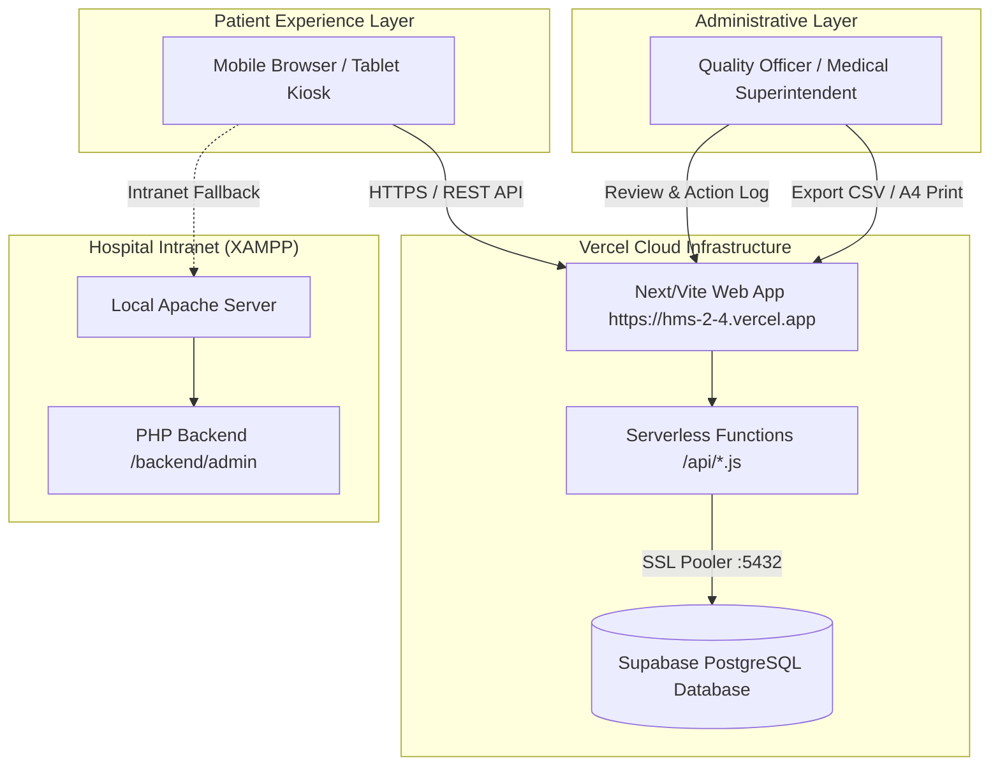
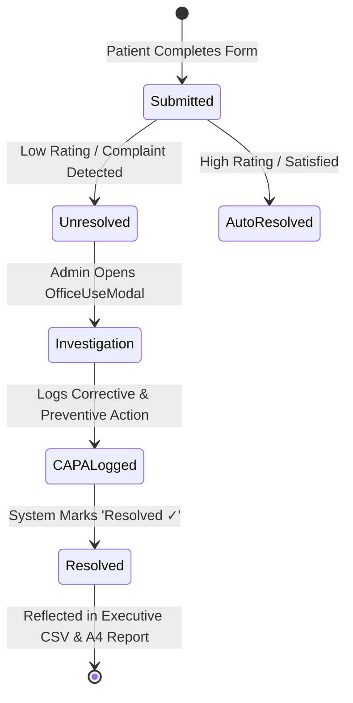

# Hospital Management System (HMS) - Visual Asset & AI Image Generation Prompts

This guide contains **high-precision AI Image Generation Prompts** (tailored for **Midjourney v6**, **DALL-E 3 / ChatGPT Plus**, **Ideogram**, or **Stable Diffusion**) to generate publication-grade visual mockups, 3D isometric architecture diagrams, infographics, and UI renders for your project report and presentation.

---

## 🎨 1. Cloud & System Architecture (3D Isometric Diagram)

> **Best for**: Section 3 of your report (System Architecture & Dual-Deployment Model)

### **Midjourney / DALL-E 3 Prompt**:
```text
3D isometric tech architecture illustration of a modern Hospital Management System. On the left side, patient tablet kiosks and mobile phones connecting via HTTPS to a glowing Vercel serverless cloud node. In the center, a high-tech PostgreSQL database cylinder with secure neon teal connection lines and data encryption shields. On the right side, a local on-premise hospital server rack (XAMPP / Apache) and an administrator desktop workstation displaying clinical analytics charts. Clean minimalist white and deep teal gradient aesthetic, glassmorphism UI elements, octane render, soft ambient shadows, ultra-detailed, 8k resolution, corporate tech presentation style --ar 16:9 --v 6.0
```

---

## 📱 2. Patient Feedback Wizard & UI Mockup (Tablet & Kiosk View)

> **Best for**: Section 2 of your report (Digital Transformation & Bilingual Interface)

### **Midjourney / DALL-E 3 Prompt**:
```text
Photorealistic modern hospital reception counter with an iPad tablet kiosk mounted on a sleek white stand. The tablet screen shows a modern, polished bilingual patient feedback application (English and Tamil text) with friendly 5-star rating stars, green and teal progress bars, and glowing interactive emoji rating cards. Soft medical clinic lighting in the background with a blurred hospital lobby, clean architectural interior, bright and trustworthy atmosphere, UI/UX Behance portfolio presentation, 8k --ar 16:9 --v 6.0
```

---

## 📊 3. Admin Quality Analytics & Executive Dashboard

> **Best for**: Section 6 of your report (Clinical Decision Support & CAPA Analytics)

### **Midjourney / DALL-E 3 Prompt**:
```text
Sleek, futuristic medical administrator dashboard UI displayed on a frameless curved monitor on an executive wooden desk. The interface features a dark teal sidebar navigation, modern white metric cards displaying hospital KPIs: 'Total Responses: 2,300+', 'Resolution Rate: 96%', 'Average Rating: 4.8 / 5.0', multi-color department bar charts, and a clean problem resolution modal showing 'Corrective & Preventive Action Log'. Modern SaaS web interface, clean typography, soft drop shadows, Figma UI design showcase, photorealistic, 8k --ar 16:9 --v 6.0
```

---

## 🔄 4. Before & After: Paper Form to Digital Healthcare Platform

> **Best for**: Section 1 of your report (Executive Summary & Problem Statement)

### **Midjourney / DALL-E 3 Prompt**:
```text
Split-screen conceptual visual showing healthcare digital transformation. On the left side: traditional physical 5-page paper hospital feedback forms with clipboards, pens, and paper stacks in dim warm lighting. On the right side: a luminous, ultra-clean digital tablet displaying the modernized interactive feedback app with real-time cloud sync and live analytics charts in crisp cool hospital lighting. High-contrast conceptual corporate illustration, hyper-realistic, 8k resolution --ar 16:9 --v 6.0
```

---

## 🛠️ 5. Complaint Resolution & CAPA Workflow Infographic

> **Best for**: Section 5 of your report (QA Defect Matrix & Office Investigation Workflow)

### **Midjourney / DALL-E 3 Prompt**:
```text
Minimalist 3D step-by-step infographic flowchart on a clean white background illustrating hospital complaint resolution workflow: Step 1: Patient Submits Feedback with low rating icon; Step 2: Instant Alert sent to Quality Administrator; Step 3: Quality Officer opens Office Investigation Modal; Step 4: Corrective and Preventive Actions (CAPA) logged into PostgreSQL database; Step 5: Green checkmark badge with 'Resolved ✓' status. Sleek 3D icons, teal, emerald green, and amber accents, high-end corporate presentation graphic, 8k --ar 16:9 --v 6.0
```

---

## 🌐 6. Native Mermaid Visuals (Instantly Rendered in Markdown / GitHub)

You can also include these native vector diagrams directly into your Markdown files or slides:

### **A. Dual Cloud & Local Hybrid Architecture**


### **B. Problem Resolution & Investigation Lifecycle**

